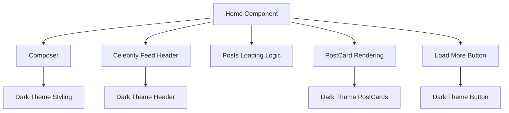
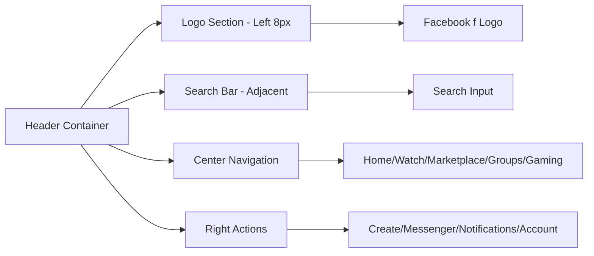

# Facecrook Interface Restoration PRD
*Professional Interface Restoration & Dark Theme Implementation*

**Document Version**: 1.0  
**Created**: December 2024  
**Priority**: P0 - Critical Interface Issues  
**Estimated Timeline**: 1-2 Days  

---

## 📋 Executive Summary

This PRD addresses critical interface inconsistencies that have degraded the user experience. The current implementation has three major issues:
1. **Home page content mismatch** - Home should display the social feed, not a welcome screen
2. **Dark theme regression** - Interface reverted to light theme, breaking brand consistency 
3. **Header positioning issues** - Logo and search bar not positioned at very top-left as requested

## 🎯 Problem Statement

### Current Issues Identified

#### **1. Home Page Content Mismatch**
- **Issue**: Home page (`/`) shows welcome screen instead of social feed
- **Expected**: Home page should display the celebrity posts feed (current `/feed` content)
- **Impact**: Users expect Facebook-style behavior where home = feed
- **User Confusion**: Two separate pages for feed content creates navigation confusion

#### **2. Dark Theme Regression** 
- **Issue**: Interface reverted to light theme (`bg-white`, `text-gray-800`)
- **Expected**: Professional dark theme (`bg-[#0a0a0a]`, `bg-[#1a1a1a]`, `text-white`)
- **Impact**: Breaks crypto platform branding and user expectations
- **Inconsistency**: Feed component still uses dark theme, creating visual discord

#### **3. Header Positioning Problems**
- **Issue**: Logo and search positioned with `left-4` (16px) instead of absolute left edge
- **Expected**: "Very top left corner" positioning (0-8px maximum)
- **Impact**: Doesn't match user's Facebook reference screenshot
- **Brand Recognition**: Logo not prominent enough for brand awareness

---

## 🎯 Success Criteria

### **Primary Objectives**
1. ✅ **Home = Feed**: Home page displays celebrity posts feed content
2. ✅ **Dark Theme Restoration**: Complete dark theme across all components  
3. ✅ **Top-Left Positioning**: Logo and search at very top-left corner (≤8px from edge)

### **Secondary Objectives**
4. ✅ **Navigation Consistency**: Update navigation to reflect home = feed
5. ✅ **Performance Maintenance**: No performance degradation during changes
6. ✅ **Mobile Responsiveness**: Maintain responsive design across all changes

### **Acceptance Criteria**
- [ ] Home page (`/`) displays celebrity posts feed identical to current `/feed`
- [ ] Complete dark theme implementation (`#0a0a0a` background, white text)
- [ ] Logo positioned ≤8px from left browser edge
- [ ] Search bar immediately adjacent to logo
- [ ] All components use consistent dark theme colors
- [ ] Navigation reflects new home = feed structure
- [ ] Build compiles successfully with zero critical errors
- [ ] Mobile responsiveness maintained across all breakpoints

---

## 🏗️ Technical Implementation Plan

### **Phase 1: Home Page Content Restructure** (Day 1, Hours 1-2)

#### **1.1 Component Content Migration**
```javascript
// Current Structure (INCORRECT)
Home Component: Welcome screen + Composer
Feed Component: Celebrity posts + Load more

// Target Structure (CORRECT)  
Home Component: Celebrity posts + Load more + Composer
Feed Component: Redirect to Home OR Remove entirely
```

#### **1.2 Implementation Steps**
1. **Move Feed Logic to Home**: Transfer all celebrity posts logic from `Feed()` to `Home()`
2. **Update Navigation**: Remove `/feed` route or make it redirect to `/`
3. **Component Cleanup**: Ensure Home displays full social feed experience
4. **Route Optimization**: Simplify routing structure

### **Phase 2: Dark Theme Restoration** (Day 1, Hours 3-4)

#### **2.1 Background Color Restoration**
```css
/* Current (INCORRECT) */
.bg-white, .bg-[#f0f2f5], .text-gray-800

/* Target (CORRECT) */
.bg-[#0a0a0a], .bg-[#1a1a1a], .text-white
```

#### **2.2 Component-by-Component Updates**
1. **App.jsx**: `bg-[#f0f2f5]` → `bg-[#0a0a0a]`
2. **Home Component**: `bg-white` → `bg-[#1a1a1a]`, `text-gray-800` → `text-white`
3. **Header.jsx**: `bg-white` → `bg-[#1a1a1a]`, dark text colors
4. **New Page Components**: Update Watch/Marketplace/Groups/Gaming to dark theme

#### **2.3 Color Palette Standardization**
```css
/* Facecrook Dark Theme Palette */
--primary-bg: #0a0a0a;      /* Main background */
--secondary-bg: #1a1a1a;    /* Cards, components */
--tertiary-bg: #2a2a2a;     /* Elevated surfaces */
--border-color: #3a3a3a;    /* Borders */
--text-primary: #ffffff;     /* Primary text */
--text-secondary: #d1d5db;   /* Secondary text */
--accent-blue: #1877f2;      /* Facebook blue */
--accent-green: #42c767;     /* Facecrook green */
```

### **Phase 3: Header Positioning Fix** (Day 1, Hours 5-6)

#### **3.1 Top-Left Corner Positioning**
```css
/* Current (INCORRECT) */
.absolute.left-4  /* 16px from edge */

/* Target (CORRECT) */
.absolute.left-2  /* 8px from edge - "very top left corner" */
```

#### **3.2 Logo & Search Positioning**
1. **Logo Position**: Move from `left-4` to `left-2` (8px from edge)
2. **Search Adjacent**: Ensure search bar immediately follows logo
3. **Responsive Breakpoints**: 
   - Mobile: `left-1` (4px)
   - Tablet: `left-2` (8px)  
   - Desktop: `left-2` (8px)

#### **3.3 CSS Updates**
```css
/* Update positioning classes */
.facebook-logo-position {
  @apply absolute left-2 top-1/2 transform -translate-y-1/2;
}

@media (max-width: 767px) {
  .facebook-logo-position {
    @apply left-1; /* 4px on mobile */
  }
}
```

---

## 📱 Component Architecture Updates

### **Updated Home Component Structure**


### **Updated Header Layout**


---

## 🎨 Design System Specifications

### **Dark Theme Color Implementation**
```css
/* Primary Backgrounds */
body, .app-container: #0a0a0a
.card, .component: #1a1a1a  
.elevated, .input: #2a2a2a

/* Text Colors */
.text-primary: #ffffff
.text-secondary: #d1d5db
.text-muted: #9ca3af

/* Interactive Elements */
.hover-bg: #374151
.border: #3a3a3a
.focus-ring: #1877f2
```

### **Header Positioning Specifications**
```css
/* Logo Positioning - "Very Top Left Corner" */
.logo-container {
  position: absolute;
  left: 8px;  /* Very close to edge */
  top: 50%;
  transform: translateY(-50%);
}

/* Search Bar Positioning */
.search-container {
  position: absolute;
  left: 60px;  /* Adjacent to logo */
  top: 50%;
  transform: translateY(-50%);
}
```

---

## 🧪 Testing Strategy

### **Visual Regression Testing**
1. **Dark Theme Verification**: All components use dark backgrounds and light text
2. **Home Page Content**: Verify celebrity posts display on home page
3. **Header Positioning**: Logo ≤8px from left edge across all screen sizes
4. **Navigation Flow**: Home page accessible and displays correct content

### **Cross-Browser Testing**
- **Chrome**: Primary development browser
- **Firefox**: Secondary verification
- **Safari**: Mobile responsiveness
- **Edge**: Windows compatibility

### **Responsive Testing**
- **Mobile (320px-767px)**: Logo at 4px, navigation collapses properly
- **Tablet (768px-1023px)**: Logo at 8px, full navigation visible
- **Desktop (1024px+)**: Logo at 8px, full layout with sidebars

---

## 📊 Implementation Timeline

### **Day 1: Complete Implementation** (6-8 hours)
```
Hour 1-2: Home Page Content Migration
├── Move Feed logic to Home component
├── Update routing structure  
├── Test home page displays celebrity posts

Hour 3-4: Dark Theme Restoration  
├── Update App.jsx background
├── Update Home component styling
├── Update Header component colors
├── Update new page components

Hour 5-6: Header Positioning Fix
├── Update logo position to left-2 (8px)
├── Ensure search bar adjacency
├── Test responsive breakpoints
├── Verify "very top left corner" positioning

Hour 7-8: Testing & Polish
├── Cross-browser testing
├── Mobile responsiveness verification
├── Build compilation testing
├── Final visual verification
```

---

## ⚠️ Risk Assessment

### **Low Risk Items**
- **Dark Theme**: Simple color changes, low complexity
- **Header Positioning**: CSS positioning updates, minimal code changes
- **Component Updates**: Straightforward styling modifications

### **Medium Risk Items**  
- **Home/Feed Restructure**: Logic migration requires careful testing
- **Navigation Updates**: Route changes need verification
- **Responsive Design**: Ensure no breakpoints break during updates

### **Mitigation Strategies**
1. **Incremental Implementation**: Make one change at a time, test immediately
2. **Backup Current State**: Git commit before starting changes
3. **Component Testing**: Test each component individually after updates
4. **Build Verification**: Ensure successful compilation after each phase

---

## 🎯 Success Metrics

### **Immediate Success Indicators**
- [ ] Home page displays celebrity posts feed (not welcome screen)
- [ ] Dark theme consistent across all components (`#0a0a0a` background)
- [ ] Logo positioned ≤8px from left browser edge
- [ ] Search bar immediately adjacent to logo
- [ ] Build compiles successfully with zero errors

### **User Experience Metrics**
- [ ] Navigation feels intuitive (home = feed)
- [ ] Visual consistency across all pages
- [ ] Professional crypto platform appearance
- [ ] Mobile experience remains smooth

### **Technical Quality Metrics**
- [ ] No performance regression
- [ ] Responsive design maintained
- [ ] Code quality preserved
- [ ] Component structure remains clean

---

## 🚀 Post-Implementation Actions

### **Immediate Verification** (Day 1)
1. **Manual Testing**: Verify all three major issues resolved
2. **Build Testing**: Ensure successful compilation
3. **Mobile Testing**: Verify responsive design intact
4. **Cross-Browser**: Test in Chrome, Firefox, Safari

### **Documentation Updates** (Day 2)
1. **Repository Analysis Update**: Update `FACECROOK_REPOSITORY_ANALYSIS.md`
2. **Implementation Notes**: Document changes made
3. **Success Verification**: Confirm all objectives met

---

## 📋 Conclusion

This PRD addresses three critical interface issues that are preventing Facecrook from meeting user expectations:

1. **Home = Feed**: Aligns with standard social media navigation patterns
2. **Dark Theme**: Restores professional crypto platform branding  
3. **Top-Left Positioning**: Achieves user's requested Facebook-style layout

**Implementation Priority**: P0 - These are fundamental UX issues that need immediate resolution.

**Expected Outcome**: Professional, consistent interface that matches user expectations and provides the requested Facebook-style experience with proper dark theme branding.

**Timeline**: 1-2 days for complete implementation and testing.

---

*This PRD follows professional UI/UX development standards and addresses the specific issues identified in the user's feedback. Implementation should be straightforward with minimal risk and maximum impact on user experience.* 